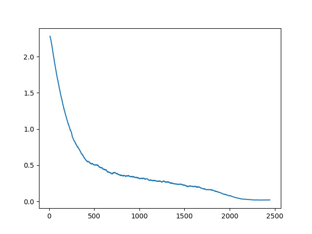
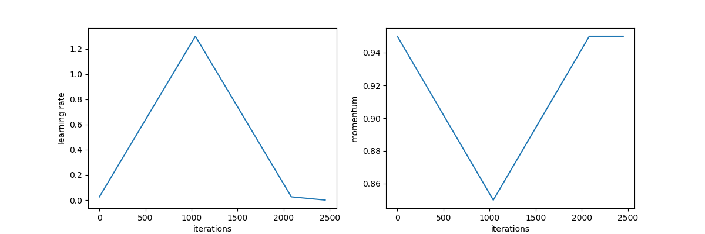

### Script

In the parent directory, run:

    time python -m multiproc.py dawn_mod.py /home/ubuntu/data/cifar10 \
    --save-dir /home/ubuntu/data/cf_train_save/wrn_submission \
    -a wrn_22 \
    --epochs 1 --cycle-len 50 \
    --fp16 --loss-scale 512 \
    -b 128 \
    --wd 2e-4 --lr 1.3 \
    --use-clr 50,15,0.95,0.85

on an Amazon p3.16xlarge instance.  You will need to symlink (ln -s YOUR_FASTAI_DIRECTORY fastai) your fastai install inside the cifar directory for the python imports (or do git clone https://github.com/fastai/fastai.git inside the parent directory).  Uses fastai master (current SHA1: https://github.com/fastai/fastai/commit/f9c3d22cdb79e9438c308e3baeb91f04944081fe) and pytorch master (.4) (https://github.com/pytorch/pytorch/commit/354dac976905ba718ea94a73c11587438ae86cde).

Dataset from:

    http://files.fast.ai/data/cifar10.tgz

## Graphs

## Paper

You should check out "A disciplined approach to neural network hyper-parameters: Part 1 -- learning rate, batch size, momentum, and weight decay":

    https://arxiv.org/abs/1803.09820

